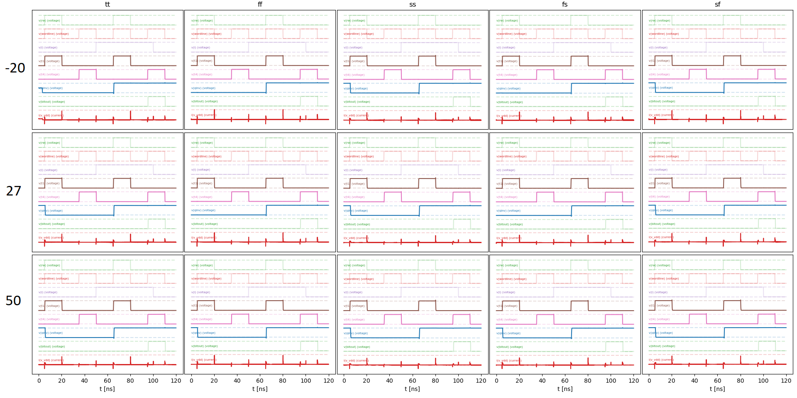

# TFE4151 Term Project 8x8 Bit Memory Array
Project with the goal of designin and testing an 8x8 bit memory array with a simple read/write controller using a 90nm technology.
The project is primarily written in verilog, and the design's bit-cells are simulated, and their power/stability measured using AimSpice.

